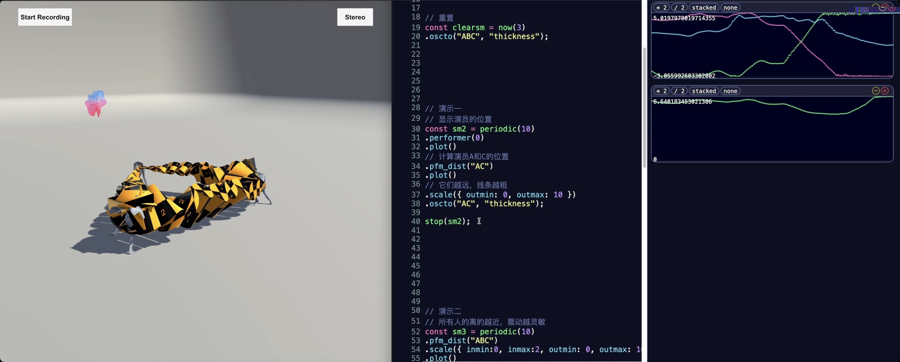
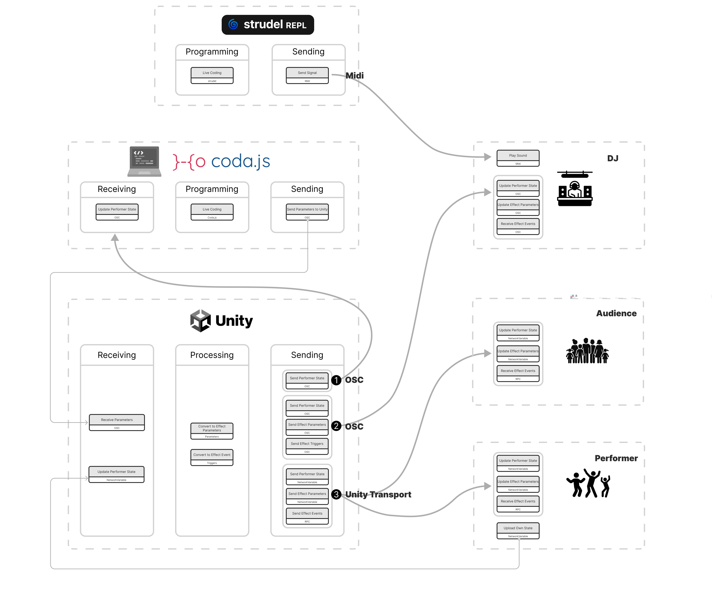

# Coda Project for GravField
Considering the real-time data processing requirements for GravField's live performances，we choose [Coda.js](https://github.com/JulesFrancoise/coda) as live-coding environment.
<div>

</div>
<br>
We added OSC communication capabilities to Coda, enabling it to receive data signals from Unity Server and send control signals back to Unity Server.
<div>

</div>

## System Requirement:
Nodejs Version: v16.20

## System Machanism:
As coda runs in web environment, it can't receive UDP messages directly. You have to start a UDP server as a message transfer station, then the UDP server will communicate with coda via websocket.

### Run Order
- Start UDP server by running command in CodaProject folder<br>
```npm run socket```
- Start Coda by running command in CodaProject folder<br>
```npm run dev```

### IP Configuration
To change the ip port that UDP server connects with, open ```/playground/server.js``` and modify ip and port in it.
#### Listening 
```
const osc = require('osc');
const udpPort = new osc.UDPPort({
  localAddress: '0.0.0.0', //listen from all possible ip address
  localPort: 13500, //change port here
  metadata: true,
});
```
#### Sending
```
const unityOscIp = "127.0.0.1";
const unityOscPort = 13600;
```

## Avaliable Functions
- ```performer(id)``` to get performer position. 
- ```oscto(id, address)``` to send command to specific performer.
- ```osctoall(address)``` to send command to all performers.
- ```pfm_maxy(ids)``` to calculate max of Y position among specific performers.
- ```pfm_miny(ids)``` to calculate min of Y position among specific performers.
- ```pfm_dist(ids)``` to calculate distance between specific performers.

## Avaliable Address
Sending data to osc adress is setting a parameter in Unity application. Current available address includes
| OSC Address | Need Specify ID | Rough Range | Type | Description
|----------|----------|----------|----------|----------|
|mode | No | 0, 1, 2 | int | Change effect mode|
|  |  |  |  | 
| rope-mass | Yes | [20, 80] | float | How heavy the rope is. | 
| rope-maxwidth | Yes	[1, 40] | float | Max thickness of the central part of the rope | 
| rope-scaler | Yes	[1, 10] | float | Make it easier to swing the rope | 
| rope-offset | Yes	[-10,10] | float | Vertical offset to head | 
|  |  |  |  | 
| spring-freq | Yes | [0, 200] | float | Sine frequency | 
| spring-width | Yes | [0.2, 400] | float | Max width | 
|  |  |  |  | 
| mag | Yes | 0,1 | int | Is positve | 
| magrandom | No	 | 0,1 | int | Randomize magnetic for all|

> Coda will add ```/``` automatically to complete osc address for you.

## Usage Example 

```
const sm = periodic(1000)
// change to mode 0
.constant(0)
.osctoall("mode");
```

```
const sm = periodic(10)
// show position of performer A
.performer("A")
.plot()
// calculate distance between A and C
.pfm_dist("AC")
.plot()
// set thickness react with distance
.scale({ outmin: 0, outmax: 10 })
.oscto("AC", "thickness");
```


